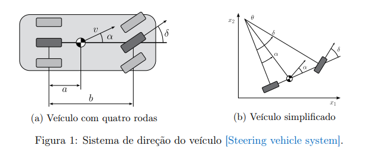

# descrição do problema:

## 1. informaçções iniciais:

1. **a = distancia entre a roda traseira e o centro de massa**
2. **b = distancia entre as duas rodas**
3. **v = velocidade do centro de massa (constante)**
4. **θ = angulo entre o corpo da biclicleta e a orizontal**
5. **α = angulo da velocidade do centro de massa em relação ao corpo da bicicleta (angulo de deslizamento)**
6. **δ = angulo da direção da roda da frente em relação ao corpo da bicicleta**
7. **x1 = posição no eixo x**
8. **x2 = posição no eixo y**

### x1' e x2'

notamos que decompondo a velocidade no eixo x e y (x1 e x2), teriamos as velocidades relativas a cada eixo (dx1/dt e dx2/dt). para tanto, montamos um triangulo entre o o vetor da velocidade e a horizontal, que terá angulo (α + θ) e a partir disso, separamos as componentes:

$$
\binom{\frac{dx1}{dt} = v\cos{(α + θ)}}{\frac{dx2}{dt} = v\sin{(α + θ)}}
$$

### θ'

como chegamos ao θ'?

$$
\binom{\frac{θ}{dt} = \frac{v}{b}\tan{δ}}{}
$$

### α

xomo xhegamos ao α?
$$
\alpha(δ) = \arcctg{(\frac{a}{b}\tan{δ})}
$$

### entrada e saida

sendo a entrada u(t) e a saida y(t), ele nos pede:
$$
\binom{u(t) = \theta}{y(δ) = \theta(t)}
$$

### Discursão sobre o problema

Então, basicamente, nos temos que, atraves da direção das rodas, controlar para onde o nosso carro está indo, pois, de acordo com o nosso δ, nosso alfa irá mudar, se nosso alfa for diferente de 0, nosso teta irá mudar, e com isso, nossa saida estará mudando. Se por exemplo, nossso δ fosse zero, a nossa bicicleta não mudaria de direção.

## 2. Parametros iniciais

### Gerando disturbios:

A partir do do nosso numero de matricula geraremos os parametros a, b e v

SIDS DO GRUPO:

1. andré - 562391
2. arthur carrah - 570754
3. Arthur Melo - 566998
4. avi - 567090
5. Gustavo - 567464

Maior SID do grupo (S = 570754)

?Como calcular o ξ?

### Calculando parametros:

$$
\begin{aligned}
    a &= 1.5(1 + 0.1ξ)m = ?\\
    b &= 3.0(1 + 0.1ξ)m = ?\\
    c &= 10(1 + 0.1ξ)m/s = ?\\
\end{aligned}
$$

## 3. TAREFA 1:

Nessa parte vamos definir nosso mmodelo matematico;

### 3.1
2 definir modelo completo

temos que:
$
X(t) = 
\begin{bmatrix} 
    x1(t)\\ x2(t)\\ \theta(t)
\end{bmatrix} \\
$
